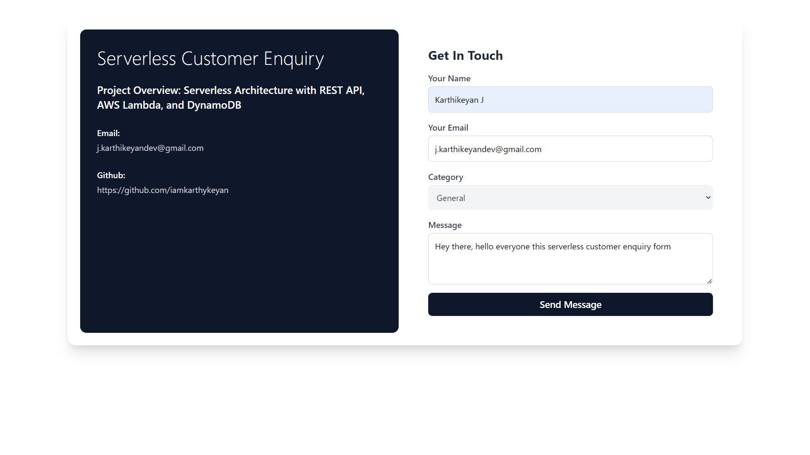
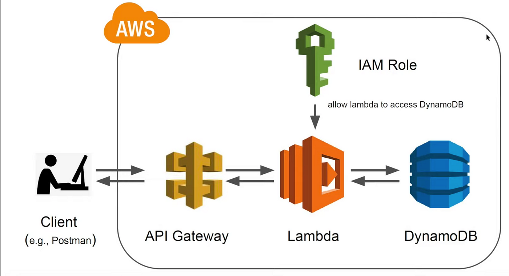
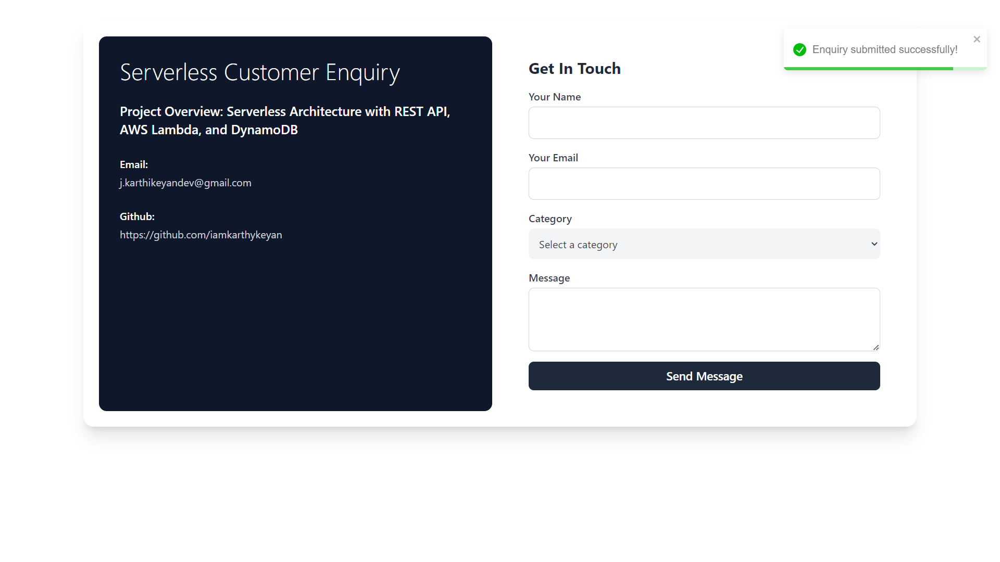
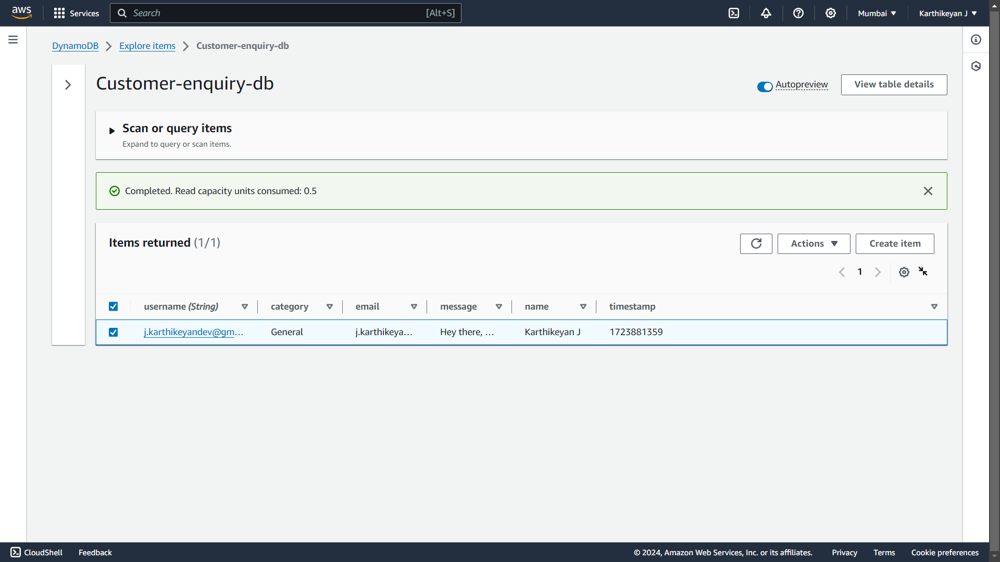

# Serverless Customer Enquiry

## Overview

The **Serverless Customer Enquiry** project is designed to handle customer data submissions using a REST API, Lambda functions, and DynamoDB. This serverless architecture ensures scalability, low maintenance, and cost-effectiveness.

## Serverless Webpage

## Architecture

The architecture consists of the following components:

1. **API Gateway**: Handles HTTP requests and routes them to the Lambda function.
2. **AWS Lambda**: Processes the incoming requests and interacts with DynamoDB.
3. **DynamoDB**: Stores the customer data in a NoSQL database.
4. **IAM Policies**: Manages permissions for Lambda functions to interact with DynamoDB.

## Successful Message

When the data is successfully posted to the database, the following success message is returned:

## AWS Database - DynamoDB

